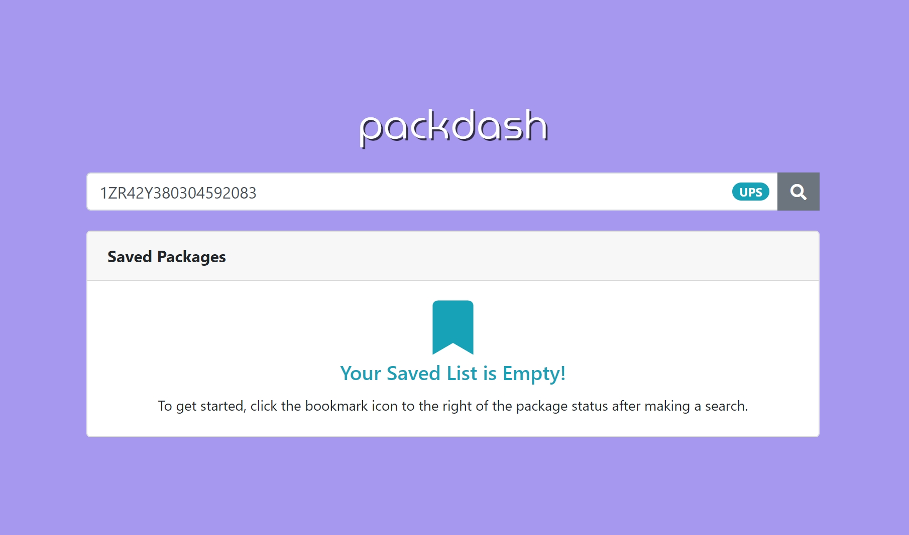
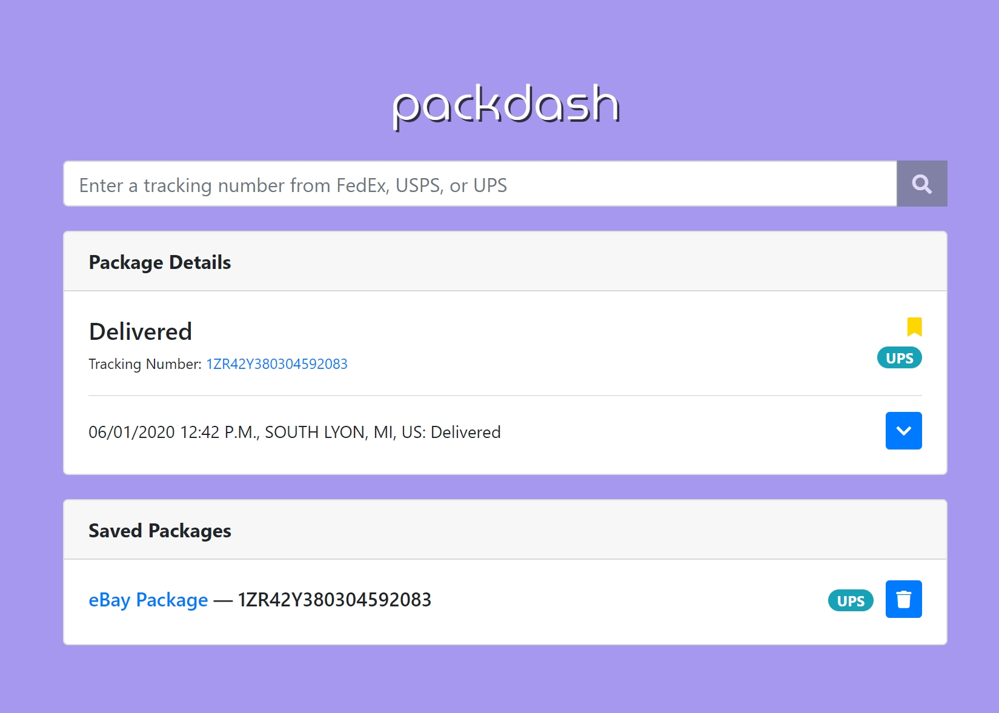
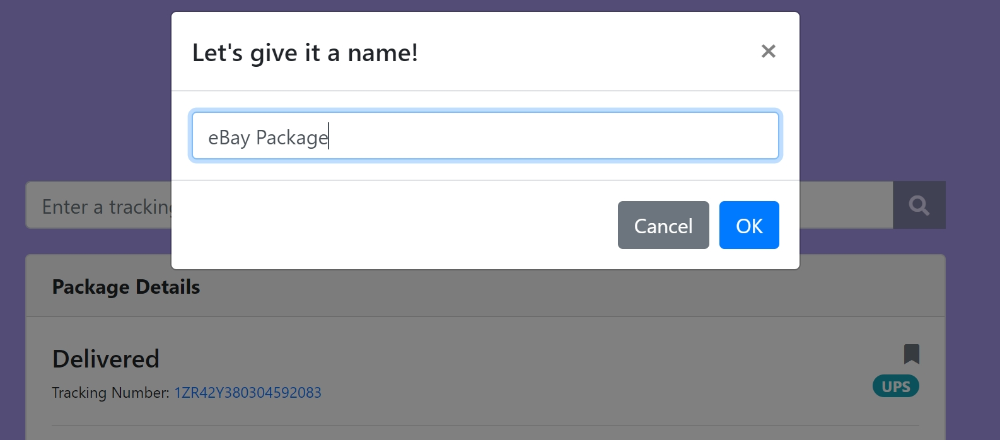
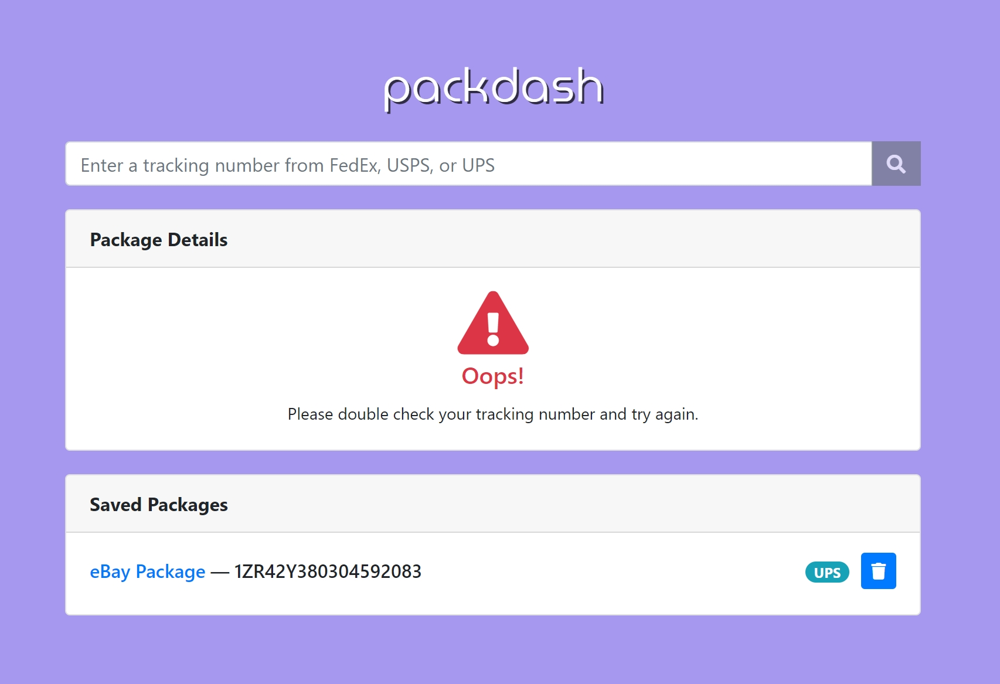
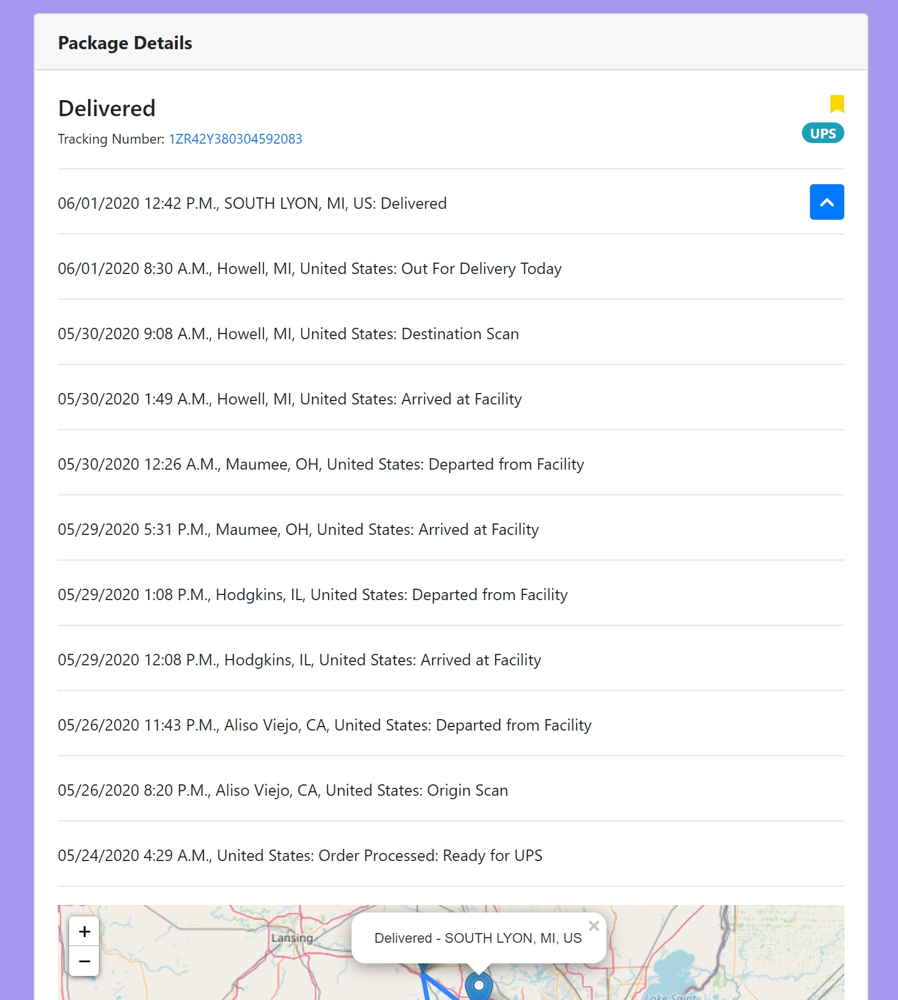

# packdash

Created by Weidi Zhang

## Feature Overview

- Automatically detects the package carrier of a tracking code (supporting FedEx, UPS, and USPS)
- Expandable package details while first showing a card with the essential information
- Map visualizing the travel path of a package when viewing package details, automatically focused on most recent locations first
- Ability to save (or "bookmark") and name certain packages for quick access later
- Fluid and user-friendly interface taking advantage of redundancy, animations, and prompts

## Screenshots

**Home:**



**Package Details:**



**Bookmark Prompt:**


**Errors:**



**Expanded Details:**



# Architecture / Design

## Frontend

The frontend uses React and Redux together, with React powering the rendered views and Redux managing global application states.

Redux is also used with middlewares such as redux-persist and redux-thunk to save the bookmarked packages state and dispatch actions involved between API calls.

Essentially, a sample flow could be the following:

1. User enters a tracking number and starts the search through the search bar component, which dispatches multiple redux actions
2. These actions change the package details card render state to tell it information is loading while an API call is being made
3. Once done, the render state and information from the API is now available through more state updates
4. User can see package status and map visualization
5. User clicks to bookmark a package
6. Prompt appears asking for an optional name
7. Redux action for adding a bookmark is triggered
8. Package now appears in the saved packages card, where the item can be clicked to quickly trigger a search for the saved package

## Backend

Python 3.7 is used for the backend, using the Flask framework with Flask-RESTful as the main library helping power the backend API. It follows general RESTful good practices.

The backend API supports FedEx, UPS, and USPS. It first fetches details from the respective carrier APIs, parses and pre-processes this data for a consistent output format, then attaches geolocation data to specific package events that are used to create map markers on the frontend.

For example, a request to ```/carrier/ups/1Zxxxxxxxxxxxxxxx``` would output data that resembles the following:

```
{
    "lastUpdate": "06/01/2020 12:42 P.M., SOUTH LYON, MI, US: Delivered",
    "locationMarkers": [
        {
            "eventText": "Departed from Facility - Aliso Viejo, CA, United States",
            "position": [
                33.576138,
                -117.725812
            ]
        },
        {
            "eventText": "Departed from Facility - Hodgkins, IL, United States",
            "position": [
                41.768921,
                -87.857835
            ]
        },
        {
            "eventText": "Departed from Facility - Maumee, OH, United States",
            "position": [
                41.562829,
                -83.653824
            ]
        },
        {
            "eventText": "Out For Delivery Today - Howell, MI, United States",
            "position": [
                42.607255,
                -83.929395
            ]
        },
        {
            "eventText": "Delivered - SOUTH LYON, MI, US",
            "position": [
                42.451377,
                -83.659179
            ]
        }
    ],
    "previousDetails": [
        "06/01/2020 8:30 A.M., Howell, MI, United States: Out For Delivery Today",
        "05/30/2020 9:08 A.M., Howell, MI, United States: Destination Scan",
        "05/30/2020 1:49 A.M., Howell, MI, United States: Arrived at Facility",
        "05/30/2020 12:26 A.M., Maumee, OH, United States: Departed from Facility",
        "05/29/2020 5:31 P.M., Maumee, OH, United States: Arrived at Facility",
        "05/29/2020 1:08 P.M., Hodgkins, IL, United States: Departed from Facility",
        "05/29/2020 12:08 P.M., Hodgkins, IL, United States: Arrived at Facility",
        "05/26/2020 11:43 P.M., Aliso Viejo, CA, United States: Departed from Facility",
        "05/26/2020 8:20 P.M., Aliso Viejo, CA, United States: Origin Scan",
        "05/24/2020 4:29 A.M., United States: Order Processed: Ready for UPS"
    ],
    "status": "Delivered"
}
```

In general, the API supports endpoints in the format ```GET /carrier/{carrier}/{tracking}``` where ```{carrier}``` is ```(fedex|ups|usps)``` and ```{tracking}``` is the tracking number.

## Installation and Configuration

1. Ensure latest version of [Node.js](https://nodejs.org/en/) is installed
2. Ensure Python 3.7.x is installed
3. Run ```npm install``` in the root ```/``` directory of the project to install required node packages
4. Run ```pip install -r requirements.txt``` in the ```/backend/``` directory of the project to install required packages
5. Rename ```config_example.py``` to ```config.py``` after making the required changes in both ```/backend/carriers/``` and ```/backend/mapquest/``` directories

## Running packdash

1. In the ```/backend/``` directory, run ```python api_main.py``` to start the backend API server
2. In the root ```/``` directory, run ```npm start```
3. A new browser tab for ```http://localhost:3000/``` should open with the packdash app.

## License

See LICENSE.md.

Shared under [Creative Commons Attribution-NonCommercial-NoDerivatives 4.0 International (CC BY-NC-ND 4.0)](https://creativecommons.org/licenses/by-nc-nd/4.0/).
