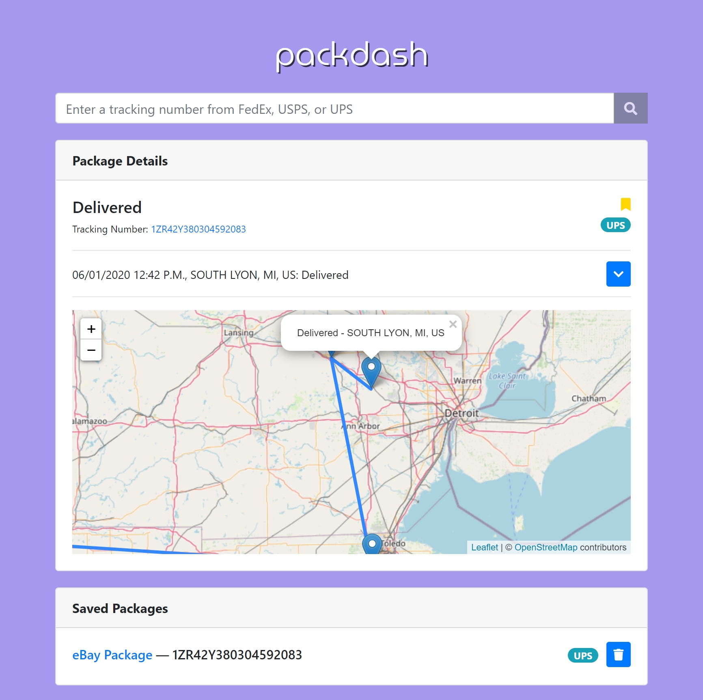

# packdash

Created by Weidi Zhang

## Feature Overview
- Fluid and user-friendly interface with animations and prompts where necessary
- Automatically detects the package carrier of a tracking code (supporting FedEx, UPS, and USPS)
- Expandable package detail results while first showing a card with the essential information
- Ability to save (or "bookmark") and name certain packages for quick access later

## Screenshots
**Main Screen:**


**Package Details:**



**Error in Package Details:**


**Expanded Details:**


## Backend

Python 3.7 is used for the backend, which creates an API wrapped around the FedEx, UPS, and USPS APIs for a streamlined interface for frontend <-> backend communications.

Note that the [requests](https://requests.readthedocs.io/en/master/) library is used as well for all web requests.

The web server used to serve the API is used to serve the frontend as well.

### File Descriptions
- ```fedex.py```, ```ups.py```, ```usps.py```: Respective classes to fetch data from a package carrier's API
- ```web.py```: Server class that serves the wrapper API and frontend website

### Running packdash
1. Edit ```config_example.py``` with USPS API key and port selection; rename to ```config.py```
2. Run ```main.py``` which starts the web server

## Frontend

ReactJS is the main JavaScript library used to write the frontend, where the main code can be found at the following path: ```frontend/js/```.

Babel is used for JSX support straight in the browser, and some other libraries such as Bootbox is used for prompts.

### File Descriptions
- ```PackageAPI.jsx```: Fetches data from the backend wrapper API
- ```PackageCard.jsx```: Component and logic for the package details card, including loading information, error handling, bookmarking, etc.
- ```PackageHook.jsx```: Hook for collapse animation triggers done by external library
- ```PackageSaved.jsx```: Handler class for all the saved packages; also pre-sorts them for friendly display
- ```SavedCard.jsx```: Component and logic for the saved packages card, which shows basic saved package information and actions
- ```SearchBar.jsx```: Component and logic for the search bar that handles carrier detection and passing information to the package card component

### Notes
The script tag for React and ReactDOM in ```frontend/index.html``` should be replaced with production versions of the library when not in development.
